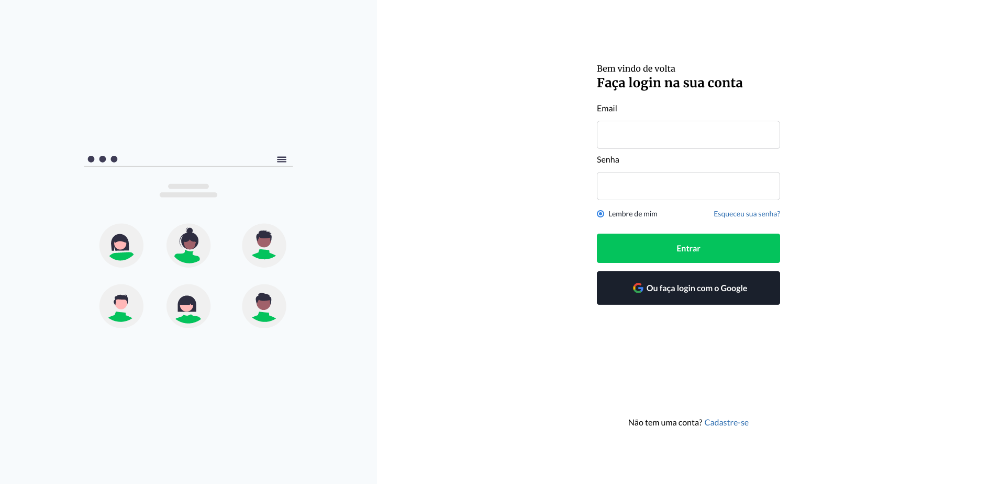
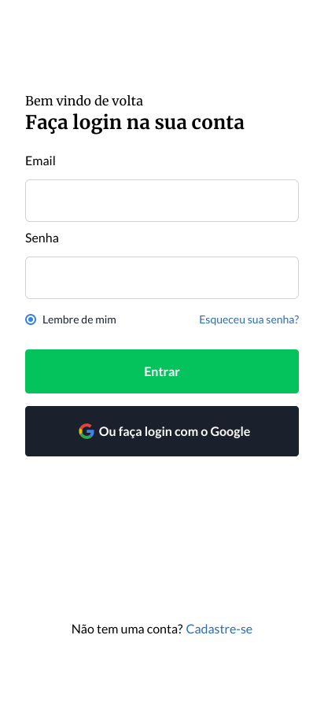

## Projeto
Esse é um projeto feito como um dos desafio do codelândia para prática de habilidades front-end ui/ux. Nesse projeto foi utilizado o [Nextjs](https://nextjs.org/) para melhor performance e o [TailwindCss](https://tailwindcss.com/) para a estilização do site.

## Desktop

## Mobile 

